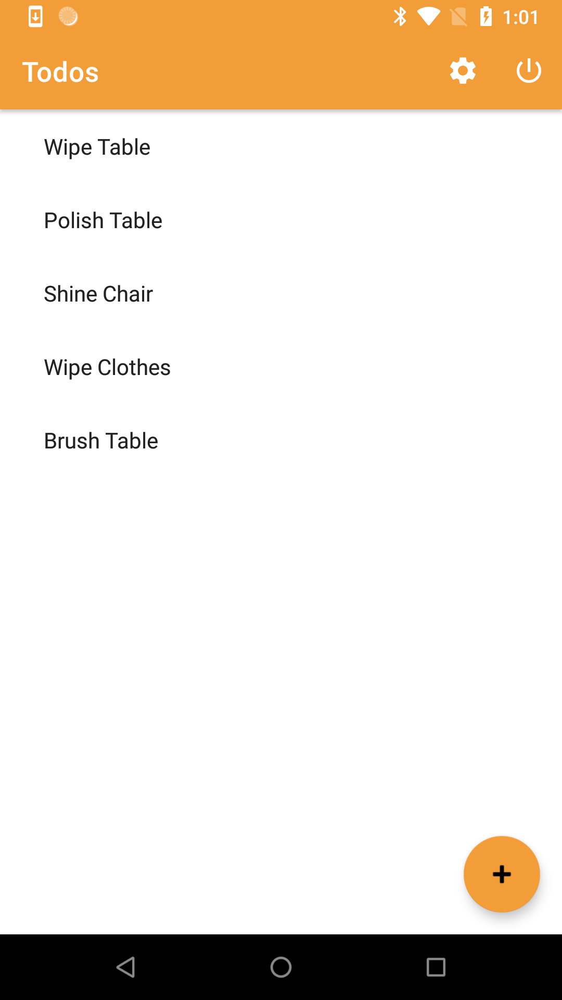

# DataStore Sample App

The purpose of this application is to test the Amplify DataStore.



## Installation
To use, install, and evaluate this application, please do the following:

2. Import this current project into Android studio. Try to build it.

3. Using the [`schema.graphql`](./schema.graphql) as below,
   generate models and deploy an AppSync backend. Make sure that this
   step updates your local configuration.
```graphql
type Todo @model
    @auth(rules: [{ allow: owner }]) {
  id: ID!
  name: String!
  description: String
  status: Status!
  dueDate: AWSDateTime
}

enum Status {
    NOT_STARTED
    IN_PROGRESS
    DONE
}

type Blog @model
    @auth(rules: [{ allow: owner, operations: [create, update, delete] }]) {
  id: ID!
  name: String!
  posts: [Post] @connection(keyName: "byBlog", fields: ["id"])
}

type Post @model
    @key(name: "byBlog", fields: ["blogID"])
    @auth(rules: [{ allow: owner, operations: [create, update, delete] }]) {
  id: ID!
  title: String!
  blogID: ID!
  blog: Blog @connection(fields: ["blogID"])
  comments: [Comment] @connection(keyName: "byPost", fields: ["id"])
  publishDate: AWSDateTime
}

type Comment @model
    @key(name: "byPost", fields: ["postID", "content"])
    @auth(rules: [{ allow: owner, operations: [create, update, delete] }]) {
  id: ID!
  postID: ID!
  post: Post @connection(fields: ["postID"])
  content: String!
}
```

Use `amplify init`, `amplify add api`. Follow the [guide to add a DataStore endpoint](https://docs.amplify.aws/lib/datastore/getting-started/q/platform/android#option-2-use-amplify-cli) --
except choose "Cognito User Pools" as the auth type, instead of API key. Run `amplify push` when done, and wait.

4. Create a valid Cognito user, in your the user pool you just created.
```sh
aws cognito-idp admin-create-user \
    --user-pool-id <pool_id_that_amplify_created> \
    --username <some_username>

aws cognito-idp admin-set-user-password \
    --user-pool-id <pool_id_that_amplify_created> \
    --username <some_username> \
    --password <some_password> \
    --permanent
```

Add the `<some_username>` and `<some_password>` values into
`app/src/main/res/values/sign_in.xml`. For example, your `sign_in.xml`
might look as below:
```xml
<?xml version="1.0" encoding="utf-8"?>
<resources>
    <string name="username" type="id">alice</string>
    <string name="password" type="id">password</string>
</resources>
```

5. Build the app and install it on an Android device.